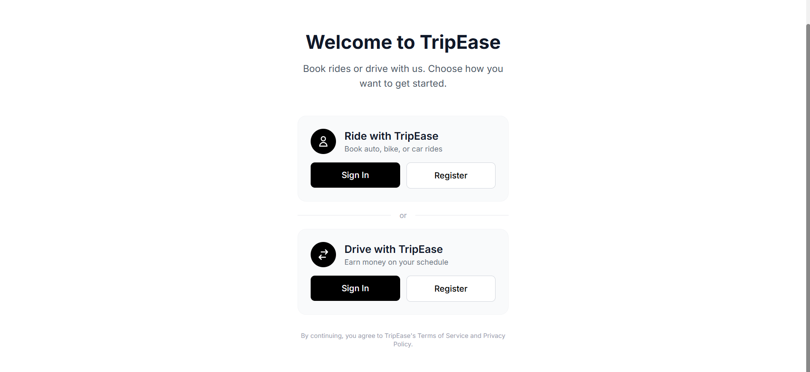
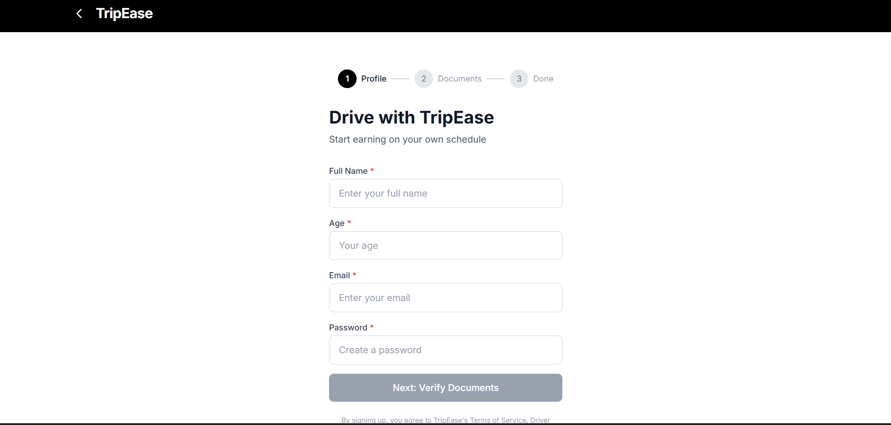

# TripEase - Ride Booking System

A full-stack ride booking application built with Spring Boot and React, featuring driver registration with document verification, customer booking, and real-time ride management.

## 🚀 Features

### Customer
- User registration & authentication (JWT)
- Book rides with multiple vehicle types (Auto, Bike, Car, Premium)
- Real-time fare calculation based on distance
- Track booking status and ride history

### Driver
- Driver registration with multi-step onboarding
- Document verification (Driving License, Aadhaar, PAN)
- Accept/reject ride requests
- Start and complete trips
- Earnings dashboard

## 🛠️ Tech Stack

### Backend
- **Java 17** with **Spring Boot 3.x**
- **Spring Security** with JWT authentication
- **Spring Data JPA** with MySQL/H2
- **Lombok** for boilerplate reduction

### Frontend
- **React 18** with Vite
- **React Router** for navigation
- **Tailwind CSS** for styling
- **Axios** for API calls

## 📁 Project Structure

```
tripease/
├── src/main/java/com/example/tripease/
│   ├── controller/       # REST controllers
│   ├── service/          # Business logic
│   ├── repository/       # Data access
│   ├── model/            # JPA entities
│   ├── dto/              # Request/Response DTOs
│   ├── config/           # Security, CORS config
│   └── Enum/             # Enumerations
├── tripease-frontend/
│   ├── src/
│   │   ├── pages/        # Page components
│   │   ├── components/   # Reusable components
│   │   └── services/     # API services
│   └── package.json
└── pom.xml
```

## 🚀 Getting Started

### Prerequisites
- Java 17+
- Node.js 18+
- Maven

### Backend Setup
```bash
cd tripease
mvn spring-boot:run
```
Backend runs at `http://localhost:8080` (or `8081`)

### Frontend Setup
```bash
cd tripease-frontend
npm install
npm run dev
```
Frontend runs at `http://localhost:5173`

## 📡 API Endpoints

### Authentication
| Method | Endpoint | Description |
|--------|----------|-------------|
| POST | `/auth/register/driver` | Register new driver |
| POST | `/auth/register/customer` | Register new customer |
| POST | `/auth/login/driver` | Driver login |
| POST | `/auth/login/customer` | Customer login |

### Driver Documents
| Method | Endpoint | Description |
|--------|----------|-------------|
| POST | `/driver/documents/submit` | Submit driver documents |
| GET | `/driver/documents/status/{driverId}` | Get document status |

### Rides
| Method | Endpoint | Description |
|--------|----------|-------------|
| POST | `/ride/book` | Create new booking |
| GET | `/ride/pending` | Get pending bookings |
| POST | `/ride/accept/{id}` | Accept booking |
| POST | `/ride/start/{id}` | Start trip |
| POST | `/ride/complete/{id}` | Complete trip |

## 📸 Screenshots

### Landing Page


### Driver Registration


## 📝 License

This project is for educational purposes.
